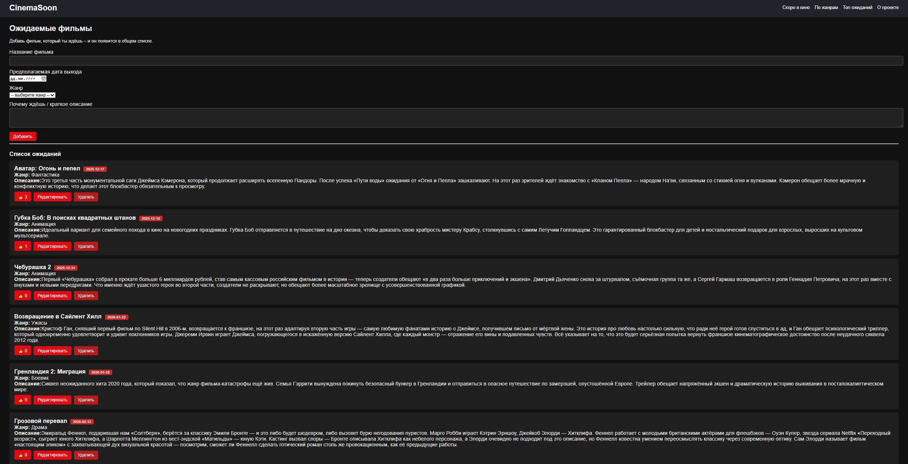
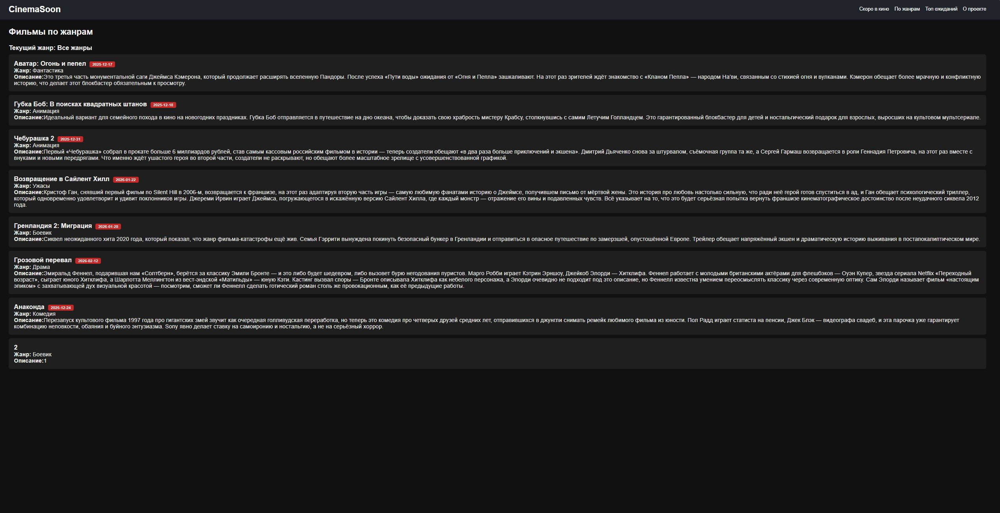
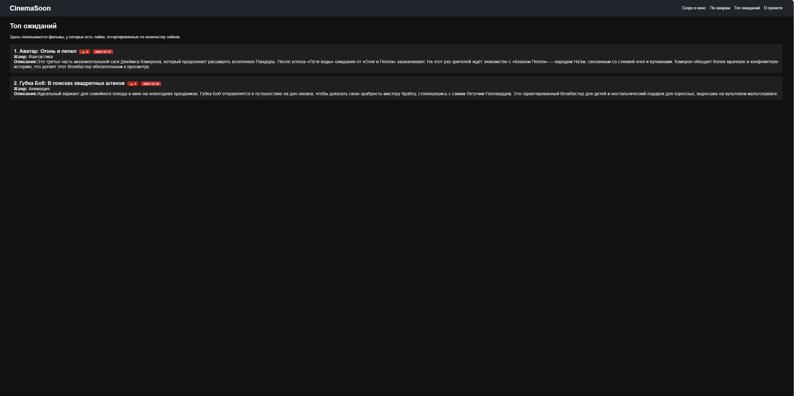
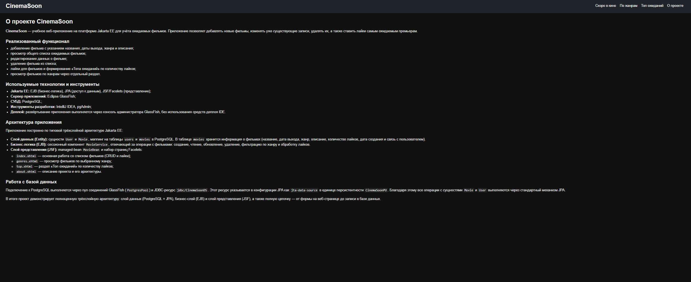

# CinemaSoon 🎬

**CinemaSoon** — учебное веб-приложение на платформе **Jakarta EE** для учёта ожидаемых фильмов.  
Пользователь может добавлять фильмы, редактировать и удалять записи, ставить лайки и смотреть топ самых ожидаемых премьер.

Проект выполнен в рамках **практической работы №1** «Приложение с типовой архитектурой Jakarta EE».

---

## Функциональность

- добавление фильма с указанием:
    - названия;
    - предполагаемой даты выхода;
    - жанра (из списка);
    - описания / комментария;
- просмотр общего списка ожидаемых фильмов;
- редактирование информации о фильме;
- удаление фильма;
- лайки для фильмов (формирование раздела «Топ ожиданий»);
- просмотр фильмов по жанрам (через меню «По жанрам»);
- информационная страница «О проекте».

---

## Используемые технологии

- **Jakarta EE**:
    - JPA — сущности `User` и `Movie`, маппинг на таблицы БД;
    - EJB (Stateless Session Bean) — бизнес-логика в `MovieService`;
    - JSF / Facelets — слой представления (`MovieBean` и страницы `.xhtml`).
- **Сервер приложений**: Eclipse GlassFish.
- **СУБД**: PostgreSQL.
- **Инструменты**: IntelliJ IDEA, pgAdmin, Git, GitHub.
- **Сборка проекта**: Maven.

---

## Архитектура

Приложение реализовано по классической **трёхслойной архитектуре**:

1. **Слой данных (Entity, JPA)**
    - Сущность `User` → таблица `users`.
    - Сущность `Movie` → таблица `movies` (название, дата выхода, жанр, описание, дата создания, лайки, ссылка на пользователя).
    - SQL-скрипт создания и заполнения БД: `db/schema.sql`.

2. **Бизнес-слой (EJB)**
    - Сессионный компонент `MovieService` (`@Stateless`) выполняет:
        - получение всех фильмов;
        - поиск по жанру;
        - формирование топа по лайкам;
        - создание, обновление и удаление записей;
        - обработку лайков.

3. **Слой представления (JSF / Facelets)**
    - Managed-bean `MovieBean` (`@Named @SessionScoped`) управляет данными на страницах.
    - Основные страницы:
        - `index.xhtml` — добавление, просмотр, редактирование, удаление и лайки;
        - `genres.xhtml` — фильмы по жанрам;
        - `top.xhtml` — топ ожиданий;
        - `about.xhtml` — описание проекта;
        - общий шаблон `WEB-INF/template.xhtml` — шапка, меню и базовые стили.

---

## Работа с базой данных

1)  Создать базу данных в PostgreSQL, например:
2)  Добавить CREATE DATABASE cinemasoone;
3)  В pgAdmin открыть базу cinemasoone и выполнить скрипт: db/schema.sql
    (Скрипт создаёт таблицы users и movies и заполняет таблицу users начальными данными)
---

## Скриншоты

Главная страница:

Фильмы по жанрам:

Топ ожиданий:

О проекте:

